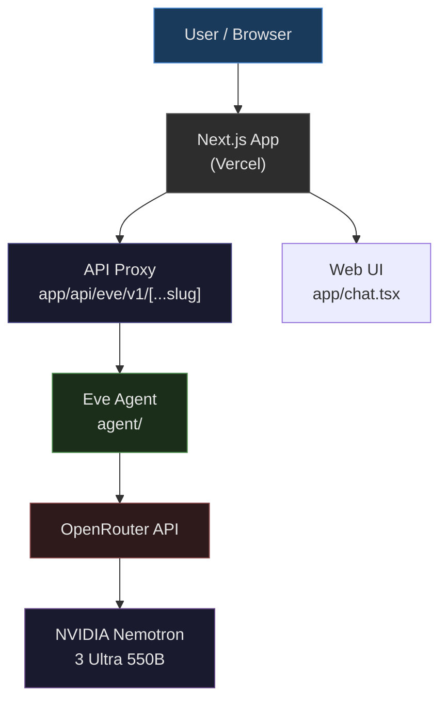
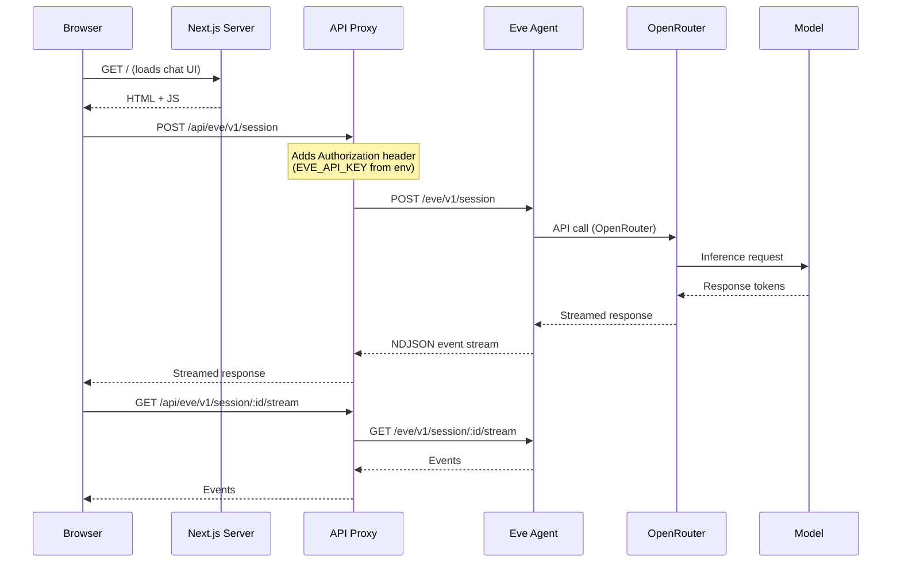
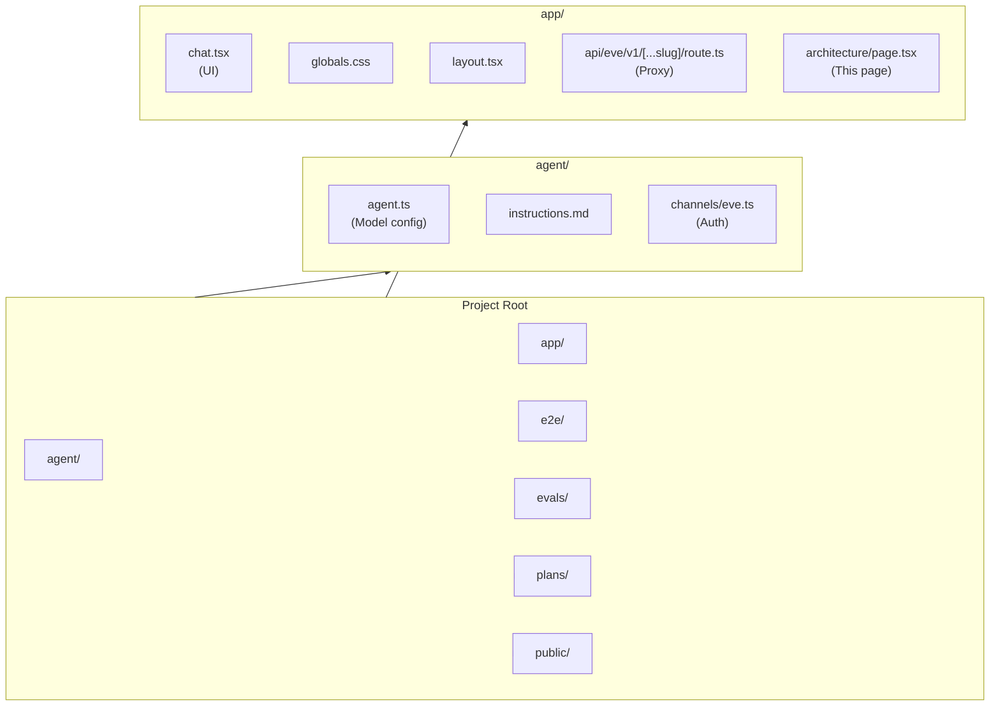
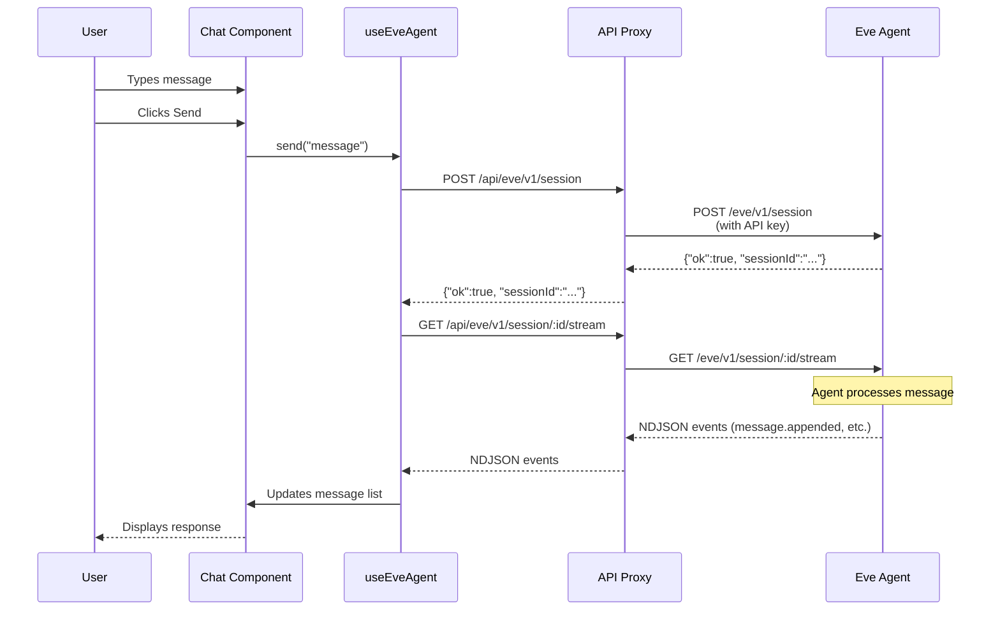

# Architecture

This document describes the architecture of the Agent Eve application.

## System Overview

## Request Flow

## Authentication Flow

```mermaid
flowchart LR
    subgraph Production
        VP["Vercel Platform Call"] -->|OIDC| V["vercelOidc()"]
        V -->|Authenticated| C["Channel<br/>eve.ts"]
    end

    subgraph Development
        LD["Local Dev Request"] -->|localhost| L["localDev()"]
        L -->|Authenticated| C
    end

    subgraph External
        API["API Client<br/>(Bearer Token)"] -->|Authorization header| BA["bearerAuth()"]
        BA -->|Valid token| C
        BA -->|Invalid token| R["401 Unauthorized"]
    end

    style VP fill:#1a3a5c,stroke:#4a8ad4
    style LD fill:#2d2d2d,stroke:#555
    style API fill:#2e1a1a,stroke:#8a4a4a
    style C fill:#1a2e1a,stroke:#4a8a4a
    style R fill:#3a1a1a,stroke:#8a3a3a
```

## Deployment Architecture

```mermaid
graph TB
    subgraph Production["Production (Vercel)"]
        PA["agent-eve-gold.vercel.app"]
        PA -->|No auth wall| PP["API Proxy"]
        PA -->|No auth wall| PU["Web UI"]
    end

    subgraph Preview["Preview (Vercel)"]
        PR["agent-*.vercel.app"]
        PR -->|Vercel Auth| PRP["API Proxy"]
        PRP -->|Bypass header| PRE["Eve Agent"]
        PR -->|Vercel Auth| PRU["Web UI"]
    end

    subgraph Local["Local Development"]
        L["http://localhost:3000"]
        L --> LP["API Proxy"]
        L --> LU["Web UI"]
        LP -->|Direct| LE["Eve Agent"]
    end

    style Production fill:#1a2e1a,stroke:#4a8a4a
    style Preview fill:#2e2e1a,stroke:#8a8a4a
    style Local fill:#1a1a2e,stroke:#4a4a8a
```

## Project Structure

## Data Flow: Chat Session

## Environment Variables

| Variable                    | Purpose                                                             | Required         |
|-----------------------------|---------------------------------------------------------------------|------------------|
| `OPENROUTER_API_KEY`        | API key for OpenRouter model access                                 | Yes              |
| `EVE_API_KEY`               | Bearer token for Eve API authentication                             | Yes              |
| `VERCEL_PROTECTION_BYPASS`  | Bypass token for Vercel preview auth                                | For preview only |
| `DF_STATE_DRIVER`           | Dark Factory execution-memory store (`sqlite`; unset = fail-closed) | No               |
| `DF_STATE_DB_PATH`          | SQLite file path, required when `DF_STATE_DRIVER=sqlite`            | No               |
| `DF_STATE_DB_DIR`           | Optional sandbox root the state DB path must stay inside            | No               |
| `DF_DISPATCH_MAX_RETRIES`   | Dispatch retry budget                                               | No               |
| `DF_DISPATCH_BASE_DELAY_MS` | Dispatch base backoff delay in ms                                   | No               |
| `DF_METRICS_DRIVER`         | Observability store (`memory`; unset = in-process)                  | No               |
| `DF_WORKER_PROVIDER`        | Worker sandbox location (`local` dry-run; unset = local)            | No               |
| `DF_WORKER_ALLOWED_REPOS`   | Fail-closed allow-list of repos a worker task may target            | No               |
| `DF_WORKER_RUNTIME`         | Runtime inside the sandbox (`node` \| `python`)                     | No               |
| `DF_CREDENTIAL_TTL_SECONDS` | Per-task credential lease lifetime (1..3600)                        | No               |

## Dark Factory (R1)

The Dark Factory moves Eve from a stateless agent (input → output) to the
manager of a delivery loop: it remembers what it is working on, dispatches CI
failures back to a worker, and records the metrics that drive recursive
self-improvement. R1 deliberately ships only the three foundation seams — no
containers, no worker agents, no queue (those are releases R2/R3).

All three live under `agent/lib/dark-factory/` and mirror the existing
provider-seam pattern from `agent/lib/backlog-provider.ts`: a canonical,
provider-agnostic payload → a provider interface → concrete adapters, with a
default that refuses rather than silently degrading.

| Seam                    | File          | Canonical payload  | R1 adapter                           | Default                                             |
|-------------------------|---------------|--------------------|--------------------------------------|-----------------------------------------------------|
| Execution memory (#134) | `state.ts`    | `ExecutionContext` | `SqliteStateAdapter` (`node:sqlite`) | `ConsoleStateProvider` — refuses (fail-closed)      |
| Dispatch (#138)         | `dispatch.ts` | `DispatchEvent`    | `Dispatcher` over the state seam     | `console`-equivalent: throws on unconfigured driver |
| Observability (#140)    | `metrics.ts`  | `TaskMetric`       | `InMemoryMetricsStore`               | in-memory; failed writes buffered                   |

### Execution memory (#134)

`ExecutionContext` carries exactly four fields — `issue`, `worker`, `lastTest`,
`step` — normalised through `toExecutionContext`, which throws
`InvalidExecutionContextError` when a required field is missing. The `StateStore`
seam is a generic JSON key/value store (`save`/`get`, optional `close`) whose
results reuse the `PublishResult` mode vocabulary: `live`, `dry-run`, `blocked`.
A store outage is reported as `blocked` with an explicit "unreachable" error —
never as a silent empty read — and a missing key is `ok: true` with a null value,
so "not found" and "cannot read" stay distinguishable.

`createStateStore(env)` is fail-closed: an unset `DF_STATE_DRIVER` returns the
refusing console provider; `sqlite` requires `DF_STATE_DB_PATH`; anything else
throws. A file-backed SQLite store satisfies the "external store" acceptance
criterion with no dependency and no credentials, but a Vercel function's
filesystem is ephemeral, so production persistence needs a Redis/pgvector
adapter behind the same seam (later release).

`DF_STATE_DB_PATH` is canonicalised with `path.resolve` before use, and when the
optional `DF_STATE_DB_DIR` sandbox root is configured the store **refuses** any
path that resolves outside it — the same fail-closed shape as
`STORY_ALLOWED_REPOS`. The check is lexical (a symlink inside the root that points
outside it is a filesystem/container concern, part of R2's worker privilege
boundary), and with no sandbox configured the operator-trusted default applies,
since an env var is configuration rather than request input.

### Dispatch / self-correction (#138)

`Dispatcher.dispatch(event)` reads the run's state record first. Any existing
record — in flight or terminal — means the delivery is a duplicate, so the
handler is never invoked twice and a re-delivered webhook cannot double-dispatch
work. State is written through the state seam (`pending` → `retrying` →
`succeeded`/`failed`), so retries survive a process restart.

Retry is a pure function, `nextRetry(policy, failedAttempt)`, which returns the
next attempt number and its exponential delay, or `null` once the budget is
exhausted; `dispatch` then transitions the event to the terminal `failed` status
instead of retrying forever. Each attempt emits a `dispatch.attempt` event to an
observer that `dispatch` **awaits**, so a metrics sink cannot lose an event to a
floating promise.

### Observability (#140)

`TaskMetric` is `{taskType, iterations, fixCycles, status}`. The ingestion
interface is stable so components can grow new skills without changing it.
`countFixCycles` counts real fail→fix pairs (an unmatched failure or an unmatched
fix counts zero), `successRateByType` returns K/N rounded to two decimals (null
for an unknown type), and `BufferedMetricsRecorder` retains and retries any
record the backend rejected while returning `ok: false` — an unsaved metric is
never reported as stored. `createDispatchObserver(store)` adapts the dispatch
attempt stream into this store, so terminal dispatch outcomes become
`{iterations: attempts, fixCycles: attempts - 1, status}`.

### Worker environment + credential boundary (R2)

R2 gives the factory hands without giving the sandbox a key to the building.

- **`credentials.ts` (#142)** — a `CredentialBroker` holds the operator's token and
  issues the worker an opaque **lease** (repo allow-list + TTL ≤ 60 min). The sandbox
  receives the lease id and nothing else, so "MUST NOT deliver a broad PAT to any
  worker sandbox" holds by construction — the token is a real ECMAScript `#private`
  field, unreachable by property enumeration or `JSON.stringify`. Adjudication answers
  200 / 403 / 401 over **real HTTP** (`POST /authorize`, loopback-bound); lease
  **issuance is deliberately not routable**, because a sandbox must never be able to
  mint its own credential.
- **`worker-env.ts` (#135)** — a `WorkerProvider` seam
  (`provision → pushContext → exec → destroy`) with a `local` default that reports
  `isolated: false` and executes nothing. `withWorker` owns the lifecycle: it refuses
  a repo outside `DF_WORKER_ALLOWED_REPOS` **before** provisioning (403, no side
  effects), pushes the skeletal file map + PBI data before anything runs, and tears
  the environment down on every path — success, thrown error, or failed context push —
  revoking the lease alongside it.
- **`createWorkerHandler`** adapts a dispatched CI event into a worker run and records
  a `worker-env` task metric through the R1 observability seam. The default task is a
  probe, because the Developer/Tester agents are R3.

Honest limits: no live container isolation is exercised in R2 (no E2B/Modal key), so
the default provider is a dry-run that never claims otherwise. The e2b/modal adapters
plug into the same seam once credentials exist, and the credential source can be
swapped to a GitHub App installation token without changing the broker's API.
