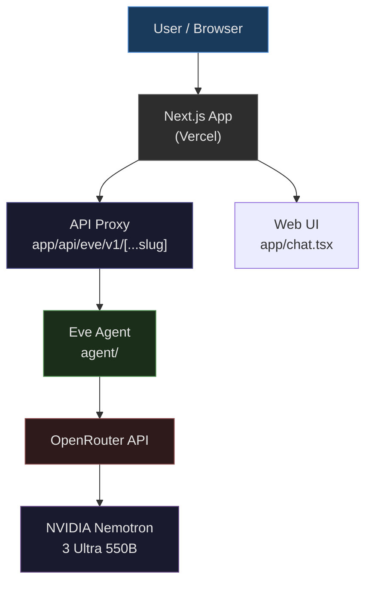
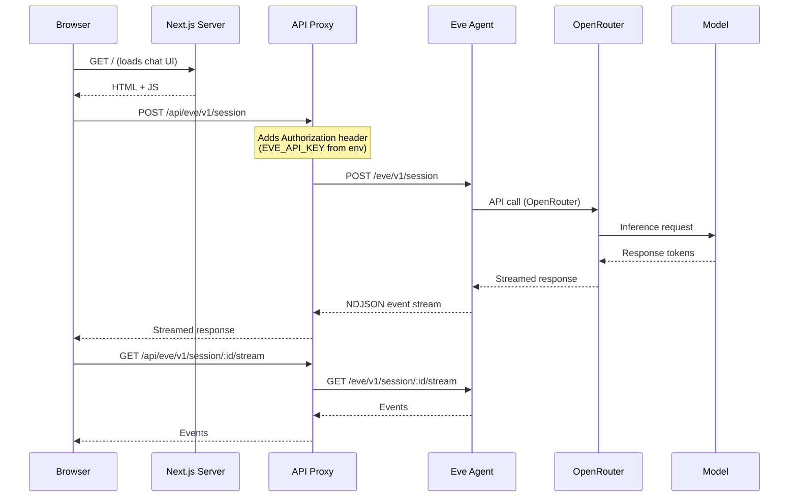
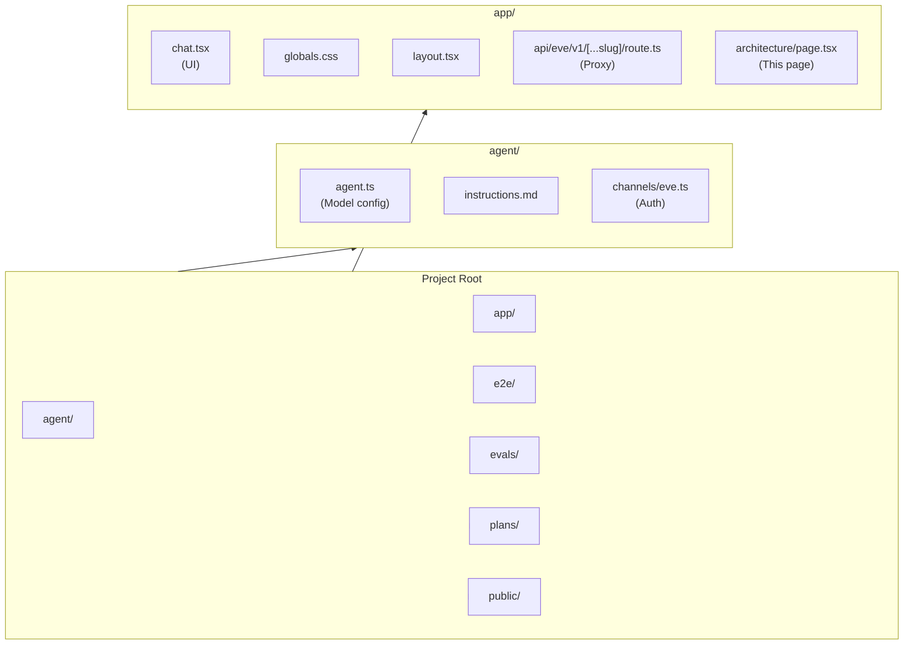
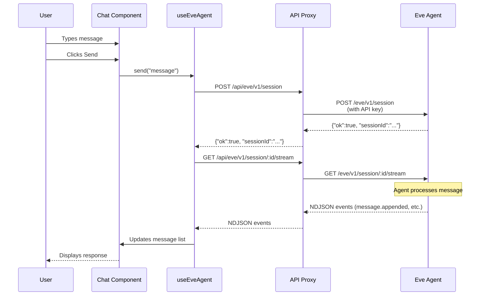

# Architecture

This document describes the architecture of the Agent Eve application.

## System Overview

## Request Flow

## Authentication Flow

```mermaid
flowchart LR
    subgraph Production
        VP["Vercel Platform Call"] -->|OIDC| V["vercelOidc()"]
        V -->|Authenticated| C["Channel<br/>eve.ts"]
    end

    subgraph Development
        LD["Local Dev Request"] -->|localhost| L["localDev()"]
        L -->|Authenticated| C
    end

    subgraph External
        API["API Client<br/>(Bearer Token)"] -->|Authorization header| BA["bearerAuth()"]
        BA -->|Valid token| C
        BA -->|Invalid token| R["401 Unauthorized"]
    end

    style VP fill:#1a3a5c,stroke:#4a8ad4
    style LD fill:#2d2d2d,stroke:#555
    style API fill:#2e1a1a,stroke:#8a4a4a
    style C fill:#1a2e1a,stroke:#4a8a4a
    style R fill:#3a1a1a,stroke:#8a3a3a
```

## Deployment Architecture

```mermaid
graph TB
    subgraph Production["Production (Vercel)"]
        PA["agent-eve-gold.vercel.app"]
        PA -->|No auth wall| PP["API Proxy"]
        PA -->|No auth wall| PU["Web UI"]
    end

    subgraph Preview["Preview (Vercel)"]
        PR["agent-*.vercel.app"]
        PR -->|Vercel Auth| PRP["API Proxy"]
        PRP -->|Bypass header| PRE["Eve Agent"]
        PR -->|Vercel Auth| PRU["Web UI"]
    end

    subgraph Local["Local Development"]
        L["http://localhost:3000"]
        L --> LP["API Proxy"]
        L --> LU["Web UI"]
        LP -->|Direct| LE["Eve Agent"]
    end

    style Production fill:#1a2e1a,stroke:#4a8a4a
    style Preview fill:#2e2e1a,stroke:#8a8a4a
    style Local fill:#1a1a2e,stroke:#4a4a8a
```

## Project Structure

## Data Flow: Chat Session

## Environment Variables

| Variable                   | Purpose                                 | Required         |
| -------------------------- | --------------------------------------- | ---------------- |
| `OPENROUTER_API_KEY`       | API key for OpenRouter model access     | Yes              |
| `EVE_API_KEY`              | Bearer token for Eve API authentication | Yes              |
| `VERCEL_PROTECTION_BYPASS` | Bypass token for Vercel preview auth    | For preview only |
