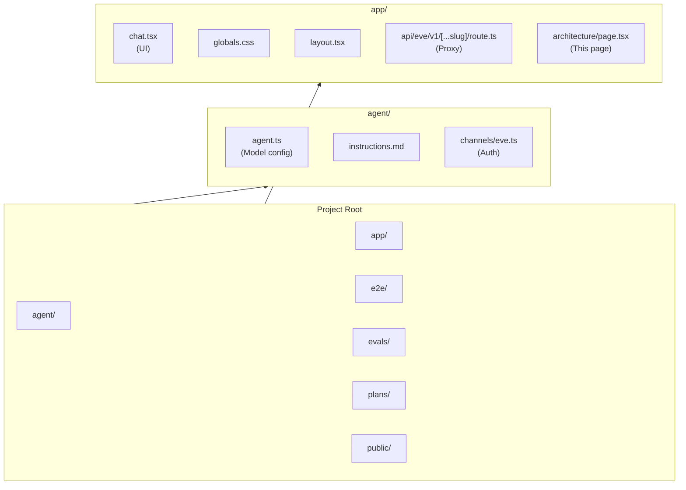

# Deployment and project structure

## Deployment Architecture

```mermaid
graph TB
    subgraph Production["Production (Vercel)"]
        PA["agent-eve-gold.vercel.app"]
        PA -->|No auth wall| PP["API Proxy"]
        PA -->|No auth wall| PU["Web UI"]
    end

    subgraph Preview["Preview (Vercel)"]
        PR["agent-*.vercel.app"]
        PR -->|Vercel Auth| PRP["API Proxy"]
        PRP -->|Bypass header| PRE["Eve Agent"]
        PR -->|Vercel Auth| PRU["Web UI"]
    end

    subgraph Local["Local Development"]
        L["http://localhost:3000"]
        L --> LP["API Proxy"]
        L --> LU["Web UI"]
        LP -->|Direct| LE["Eve Agent"]
    end

    style Production fill:#1a2e1a,stroke:#4a8a4a
    style Preview fill:#2e2e1a,stroke:#8a8a4a
    style Local fill:#1a1a2e,stroke:#4a4a8a
```

## Project Structure

```mermaid
graph LR
    subgraph Root["Project Root"]
        A["agent/"]
        APP["app/"]
        E2E["e2e/"]
        EVALS["evals/"]
        PLANS["plans/"]
        PUB["public/"]
    end

    subgraph Agent["agent/"]
        AT["agent.ts<br/>(Model config)"]
        AI["instructions.md"]
        CH["channels/eve.ts<br/>(Auth)"]
    end

    subgraph App["app/"]
        CHAT["chat.tsx<br/>(UI)"]
        CSS["globals.css"]
        LAY["layout.tsx"]
        PROXY["api/eve/v1/[...slug]/route.ts<br/>(Proxy)"]
        ARCH["architecture/page.tsx<br/>(This page)"]
    end

    Root --> Agent
    Root --> App
    Root --> E2E
    Root --> EVALS
    Root --> PLANS
    Root --> PUB
```
