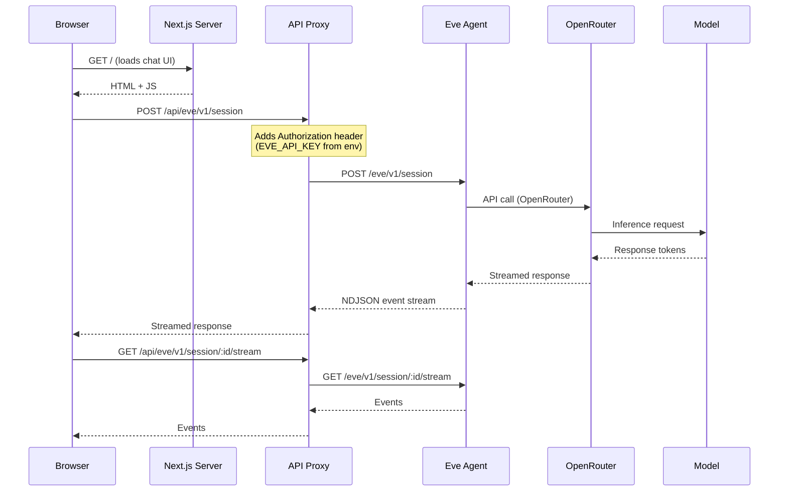
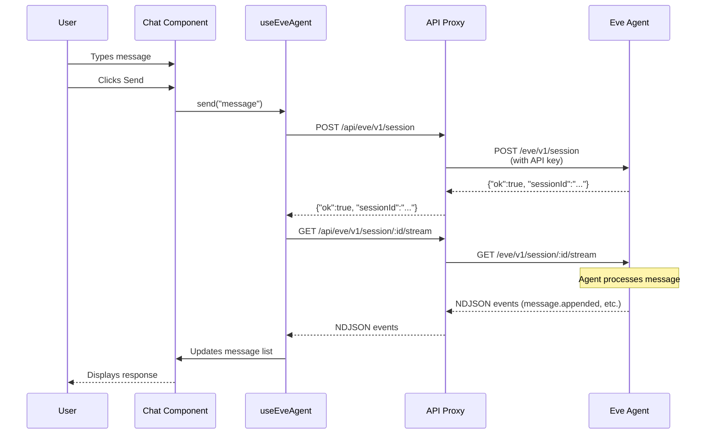

# Request and authentication flows

## Request Flow

```mermaid
sequenceDiagram
    participant B as Browser
    participant N as Next.js Server
    participant P as API Proxy
    participant E as Eve Agent
    participant O as OpenRouter
    participant M as Model

    B->>N: GET / (loads chat UI)
    N-->>B: HTML + JS
    B->>P: POST /api/eve/v1/session
    Note over P: Adds Authorization header<br/>(EVE_API_KEY from env)
    P->>E: POST /eve/v1/session
    E->>O: API call (OpenRouter)
    O->>M: Inference request
    M-->>O: Response tokens
    O-->>E: Streamed response
    E-->>P: NDJSON event stream
    P-->>B: Streamed response
    B->>P: GET /api/eve/v1/session/:id/stream
    P->>E: GET /eve/v1/session/:id/stream
    E-->>P: Events
    P-->>B: Events
```

## Authentication Flow

```mermaid
flowchart LR
    subgraph Production
        VP["Vercel Platform Call"] -->|OIDC| V["vercelOidc()"]
        V -->|Authenticated| C["Channel<br/>eve.ts"]
    end

    subgraph Development
        LD["Local Dev Request"] -->|localhost| L["localDev()"]
        L -->|Authenticated| C
    end

    subgraph External
        API["API Client<br/>(Bearer Token)"] -->|Authorization header| BA["bearerAuth()"]
        BA -->|Valid token| C
        BA -->|Invalid token| R["401 Unauthorized"]
    end

    style VP fill:#1a3a5c,stroke:#4a8ad4
    style LD fill:#2d2d2d,stroke:#555
    style API fill:#2e1a1a,stroke:#8a4a4a
    style C fill:#1a2e1a,stroke:#4a8a4a
    style R fill:#3a1a1a,stroke:#8a3a3a
```

## Data Flow: Chat Session

```mermaid
sequenceDiagram
    participant U as User
    participant C as Chat Component
    participant EA as useEveAgent
    participant P as API Proxy
    participant E as Eve Agent

    U->>C: Types message
    U->>C: Clicks Send
    C->>EA: send("message")
    EA->>P: POST /api/eve/v1/session
    P->>E: POST /eve/v1/session<br/>(with API key)
    E-->>P: {"ok":true, "sessionId":"..."}
    P-->>EA: {"ok":true, "sessionId":"..."}
    EA->>P: GET /api/eve/v1/session/:id/stream
    P->>E: GET /eve/v1/session/:id/stream
    Note over E: Agent processes message
    E-->>P: NDJSON events (message.appended, etc.)
    P-->>EA: NDJSON events
    EA->>C: Updates message list
    C-->>U: Displays response
```
