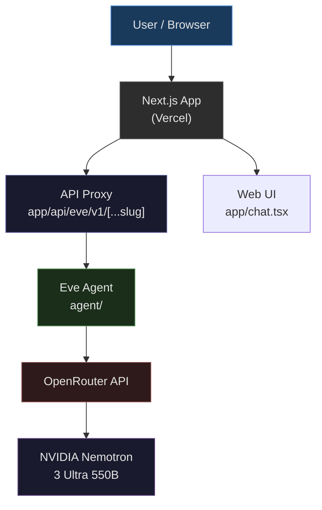

# System Overview

```mermaid
graph TB
    User["User / Browser"] --> NextJS["Next.js App<br/>(Vercel)"]
    NextJS --> Proxy["API Proxy<br/>app/api/eve/v1/[...slug]"]
    NextJS --> UI["Web UI<br/>app/chat.tsx"]
    Proxy --> EveAgent["Eve Agent<br/>agent/"]
    EveAgent --> OpenRouter["OpenRouter API"]
    OpenRouter --> LLM["NVIDIA Nemotron<br/>3 Ultra 550B"]

    style User fill:#1a3a5c,stroke:#4a8ad4,color:#e5e5e5
    style NextJS fill:#2d2d2d,stroke:#555,color:#e5e5e5
    style Proxy fill:#1a1a2e,stroke:#4a4a8a,color:#e5e5e5
    style EveAgent fill:#1a2e1a,stroke:#4a8a4a,color:#e5e5e5
    style OpenRouter fill:#2e1a1a,stroke:#8a4a4a,color:#e5e5e5
    style LLM fill:#1a1a2e,stroke:#6a4a8a,color:#e5e5e5
```
